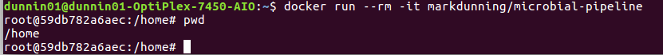

# Microbial Pipelnes and Software at The University of Sheffield


## About

This is a collection of software curated by the [Florey institute](http://www.floreyinstitute.com/) at The University of Sheffield for analysing microbial genomes. The software is collected in a [docker](https://www.docker.com/) container that can be run locally on any machine (e.g. Mac OSX, Windows) for testing purposes, or on a HPC environment (via singularity) for large-scale analysis.

## Software

Bowtie2 - on CLIMB
samtools - on CLIMB
fastqc - on CLIMB
Trim_Galore (https://github.com/FelixKrueger/TrimGalore) on CLIMB
bcftools (https://samtools.github.io/bcftools/bcftools.html) on CLIMB
vcfutils (https://github.com/lh3/samtools/blob/master/bcftools/vcfutils.pl) on CLIMB
bam2fastq (https://github.com/jts/bam2fastq)
weeSAM (http://bioinformatics.cvr.ac.uk/blog/weesam-version-1-5/)
Ugene (http://ugene.net/)
Lofreq (http://csb5.github.io/lofreq/)
Diversitools (http://josephhughes.github.io/DiversiTools/)
V-phaser 2 (https://www.broadinstitute.org/viral-genomics/v-phaser-2)
ClustalW/X (http://www.clustal.org/clustal2/)
RAxML (https://directory.fsf.org/wiki/RAxML)
KRAKEN (https://ccb.jhu.edu/software/kraken/) on CLIMB
ABySS (https://www.bcgsc.ca/platform/bioinfo/software/abyss/releases/2.1.0)
SPAdes assembler (http://cab.spbu.ru/software/spades/) on CLIMB
MIRA assembler (http://sourceforge.net/projects/mira-assembler/)
QUAST (http://sourceforge.net/projects/quast)
Scaffold_builder (http://github.com/metageni/Scaffold_builder)
Gapfiller (http://www.baseclear.com/genomics/bioinformatics/basetools/gapfiller)
Mummer (https://github.com/mummer4/mummer)
RATT (http://ratt.sourceforge.net)
Prokka (http://www.vicbioinformatics.com/software.prokka.shtml) on CLIMB
Artemis (https://www.sanger.ac.uk/resources/software/artemis/#download)
MetAMOS (https://github,com/marbl/metAMOS)
RiboPicker (http://ribopicker.sourceforge.net/)
GARM (https://sourceforge.net/projects/garm-meta-assem/)
MetaPhlAN (http://huttenhower.sph.harvard.edu/metaphlan)
DIAMOND (https://github.com/bbuchfink/diamond) + databases
KronaTools (https://github.com/marbl/Krona/wiki/KronaTools)

## Usage

### Local

To run the software on your own machine, you will first need to install the *docker* container management system. Here is a [short overview of Docker](https://markdunning.github.io/docker-overview/) for those not familiar. The links below can be used to download Docker for Mac and Windows

- https://www.docker.com/docker-mac
- https://www.docker.com/docker-windows

Once docker is setup, you can run the following command in a terminal to run the container

```
docker run --rm -it markdunning/microbial-pipeline
```

You should then notice that the command prompt has changed to reflect the fact that you are inside the *home* directory of the container. You should now be able to run any of the software installed in the container 



e.g.

```
samtools
```

You can leave the container by typing ```exit```

By default the container is isolated from your own machine. However, you can *mount* particular directories so they are accessible by adding the `-v` argument. If your `fastq` files are in a directory called `/PATH/TO/MY/DATA` you can map this to a directory called `data` using the following

```
docker run --rm -it -v /PATH/TO/MY/DATA/:/data markdunning/microbial-pipeline
```

You could then run any of included tools on your data by supplying the path `/data` to any tool. e.g.

```
fastqc /data/*
```
### HPC

For various security reasons, docker is not usually available on a HPC environment such as SHARC at the University of Sheffield. However, there is a system called [singularity](https://singularity.lbl.gov/) that can perform a similar function. The following command will create an environment on HPC for running the microbial tools


```
singularity exec /usr/local/community/Florey/singularity/microbial-pipeline.sif
```

This image itself was built with the command

```
singularity pull docker://markdunning/microbial-pipeline
```
